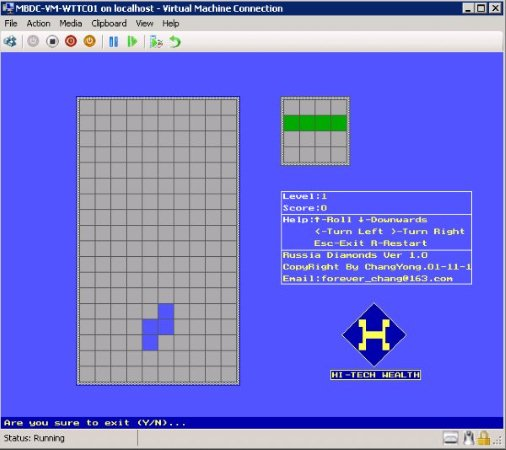

# README

当初刚毕业在恒基伟业时无聊写的。

## 运行界面

## 版本修订

1. 修改了随机函数的位置,上个程序的方块的随机产生有点问题.
2. 增加了开始游戏,退出游戏,重新开始游戏的提示.
3. 增加了快捷方式.
4. 源码在source目录下.
5. 编辑源码时用的是VC6.0,在TC2.0下编译,在TC2.0下源码看起来有点乱.

forever_chang                                                                       
2001.11.16
